+++
title = "The Unending Coil of Bahamut (Ultimate)"
url = "/ucob"
+++

# The Unending Coil of Bahamut (Ultimate)

The Unending Coil of Bahamut (Ultimate) is a high-end duty added in patch 4.11: The Legend Returns. It can be unlocked by speaking to the Wandering Minstrel in Kugane ( 11.6, 12.6 ) after completing Deltascape V4.0 (Savage).

The minimum ilvl to enter this fight is i340, but can be bypassed with a full party. All gear of an ilvl greater than i345 will be synced down to i345, and have materia slots ignored.

## Phase 1: Twintania
### Neurolinks

Throughout the first phase of the fight, Twintania will drop 3 neurolinks after reaching certain percentage points (74%, 44%, 0%). Standing inside of a neurolink will inflict players with a Neurolink status, heavily reducing their damage dealt and heavily reducing damage from hatches. Twintania will drop a neurolink under her hitbox, so the position can be manipulated by players. In order to facilitate mechanics later in the fight, I'd recommend placing neurolinks in a triangle, roughly shown below:

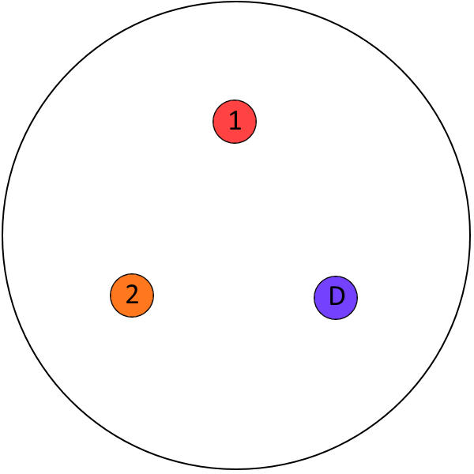
*The order the neurolinks are dropped doesn't particularly matter, as long as they are in the assigned locations. Personally, I'd start with mark [1], followed by mark [2], followed by mark [D].*

This is just one of many possible configurations. As long as neurolinks are somewhat close and equidistant to the middle, in a triangle, any configuration should be fine.

I'll divide Phase 1 into 3 separate parts, depending on when Twintania drops her neurolinks.

### Pull (100%-74%)
### Twintania's Abilities:

* **Plummet**: Cleave, dealing significant physical damage to its target.
* **Twister**: At the end of its cast, Twintania will place small tornadoes under players. Must move away at the end of the cast, as running into any of the small tornadoes results in instant death, and knock back any nearby players into the death wall.
* **Fireball**: Twintania will mark a player with a red triangle, and throw a fireball dealing significant magic damage that can be shared amongst the party.
* **Death Sentence**: Tankbuster dealing heavy physical damage to its target, and inflicting a Physical Vulnerability up. A tank swap is virtually required during the cast.

Twintania begins the pull with a **Plummet** on the tank and very shortly do a **Twister** + **Fireball** combo. All players must move away to place their twisters and then collapse into the middle to soak fireball. I'd recommend assigning a spot to each player to move out to. After soaking the Fireball, Twintania will use **Death Sentence** on the tank. A tank swap is required. Twintania will repeat this rotation until she is pushed to 74%. NOTE: Keep in mind that Shirk may not be available for every Death Sentence, as she casts it fairly frequently.

> Some groups opt to generate more LB gauge by having only 6 players stack in the fireball, to guarantee Tank LB3 when needed later in the fight.

> Twintania repeats the following until she is pushed to 74%
> * Plummet
> * Twister + Fireball
> * Death Sentence

### First Neurolink Drop (74%-44%)

Twintania gains the following abilities:

* **Generate**: A hatch (purple sphere) will appear under Twintania, and a random DPS will be marked. The hatch will slowly move toward said player. If a player is not standing in a Neurolink, the hatch will explode on the whole raid, dealing lethal damage and inflicting damage down. If in a neurolink, the hatch will explode in a large aoe (about the size of a twister), dealing menial damage to players inside a neurolink, and lethal damage to other players caught in the blast. Getting hit by a Hatch will inflict **Mana Hypersensitivity**, which will cause a second hatch to always deal lethal damage.
* **Liquid Hell (Distance)**: Targetted aoe on a player, placing a fire puddle under them. Standing in the puddle will inflict a lethal burn dot, dealing 90k damage. Twintania will always target players who are further than a certain range away from her, so make sure an assigned baiter is always the only person far away from Twintania.

After dropping her first neurolink, make sure to move her to the second location as soon as possible, as she will begin casting Liquid Hell.

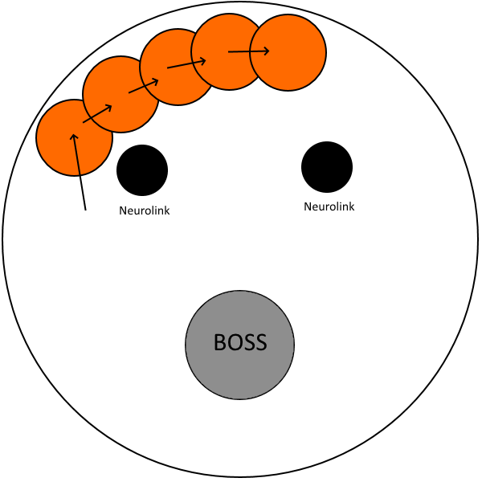
*Rough diagram showing how to bait. As long as you bait along the wall, away from the boss, you should be fine.*

Assign 1 players in your raid to be in charge of baiting **Liquid Hells**, preferably a ranged DPS. Liquid Hell will always target a random player that's past a certain distance from Twintania. In order to bait Liquid Hells, make sure your assigned baiter is the only player past this range, and all other party members are somewhat closer to Twintania. If done correctly, they should be targetted by all 5 liquid hells. Make sure to not bait a liquid hell on Neurolinks.

Twintania will then cast **Generate**, marking a random DPS player with 3 circles rotating around them, targetting them for **Hatch**. The marked player must run inside of the neurolink before the hatch explodes on them in order to mitigate damage done. The hatch will explode in a fairly large AoE, extending outside the neurolink (about the size of a Shadowflare), and any other player caught in the blast will take lethal damage. During this, Twintania will also cast another set of baited **Liquid Hells**.

> Because Generate can target any DPS, in the event your baiter is marked, I'd recommend having a second DPS serve as a backup baiter. As soon as the main baiter is marked, the backup baiter should be ready to take their place and bait the same way. 

After the second set of Liquid Hells, Twintania will cast **Death Sentence**, forcing a tank swap. She will then use **Generate** once more, immediately followed by a **Twister**. Because of the delay of the Hatch spawning, players will have to bait twisters outside the neurolink, and move in after the cast is finished. Twintania will then use **Plummet**, and repeat her rotation until she is pushed past 44%.

> Twintania repeats the following until she is pushed to 44%
> * Liquid Hell (Distance)
> * Generate
> * Liquid Hell (Distance)
> * Death Sentence
> * Generate
> * Twister
> * Plummet

### Second Neurolink Drop (44%-0%)
A few changes are made to some of Twintania's abilities:

* **Generate**: **Generate** will now create two hatches, and target two players. Because Mana Hypersensitivity will cause damage from two hatches to be lethal, regardless of in a neurolink or not, hatches must be taken in separate neurolinks.
* **Liquid Hell (Target)**: Twintania will gain a second variant of Liquid Hell. She will target a completely random player and shoot 5 liquid hells at them, regardless of their distance. This cannot be baited.

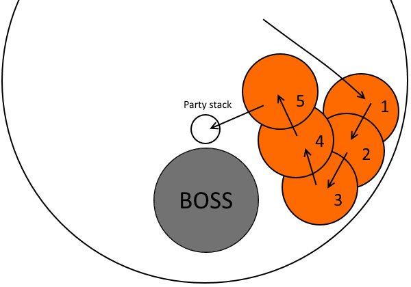
*This is simply one of many ways to move into the stack, but is not the only method. As long as you can keep the front and rear of the boss open, you should be fine.*

After dropping her first neurolink, make sure to move her to the second location as soon as possible, as she will quickly begin casting **Liquid Hell**, followed by a **Generate**. This is fairly similar to her previous rotation, except for the fact that she will mark two players. Right after markers disappear, Twintania will mark a random player with Fireball, as well as begin casting a targetted Liquid Hell on one player 5 times. After hatches are resolved, have all players (except for the liquid hell target) stack right behind Twintania to soak fireball. The player targetted for liquid hell should circle around the arena, and run into the stack after the 5th hit.

> A correctly mitigated Fireball shouldn't deal lethal damage to 7 people, so some groups opt to forego the Liquid Hell target stacking, and just take the fireball without them. The main problem with this comes with when Twintania targets the same player with both Fireball and Liquid Hells, wherein this will obviously not work.

Twintania will then cast **Death Sentence** on her target, followed by another double **Generate** into **Twisters**, similar to the pattern done in the earlier phase. She will follow up with a **Plummet**, and then repeat her rotation until she is pushed to 0% or enrages.

> Twintania repeats the following until she is killed.
> * Liquid Hell (Distance)
> * Generate x2
> * Liquid Hell (Target)
> * Fireball
> * Death Sentence
> * Double Generate
> * Twister
> * Plummet

At 3:00, Twintania will become untargettable and cast Aetheric Profusion, dealing lethal damage to all players, serving as an enrage. Twintania must be killed before this, or your party will wipe.

After defeating Twintania, she will fly away, signifying the end of Phase 1.

## Phase 2: Nael Deus Darnus

The phase begins with **Heavensfall**, a raid-wide aoe with a knockback dealing damage based on how close you are to the center. Make sure to mitigate. Immediately after the knockback is resolved, a set of glowing **Thermionic Bursts** will appear on the floor, dividing the arena into pie slices. Standing in this AoE when they explode will deal lethal damage, and inflict paralysis if you manage to survive.  At the same time, Nael will **Meteor Stream** a total of 8 party members, in 2 sets of 4. These are splash damage, so all players must spread out across the arena to prevent doubling up on damage. Afterwards, Nael will use **Dalamud Dive** and jump on the tank who held threat on Twintania, dealing significant damage. This is also splash damage, so make sure to stay away from her target (being the tank).

Nael has the following abilities:

* **Dalamud Dive**: Nael jumps onto her target, dealing significant splash damage. Make sure to spread away from the tank to prevent any extra damage.
* **Bahamut's Claw**: Physical tankbuster consisting of 5 successive hits to her target.
* **Iron Chariot**: Nael will spin around with her spear, dealing lethal damage and a knockback to any player in melee range. Has no AoE indicator or cast bar.
* **Thermionic Beam**: Nael shoots a laser at a random party member, dealing massive magic damage which can be soaked across party members. Has no cast bar or AoE indicator.
* **Lunar Dynamo**: Instant raid-wide AoE dealing lethal damage, with only 2 safe spots in melee range or very far away from Nael. Looks like a donut.
* **Raven's Dive**: Nael will randomly jump on a party member, knocking back all other players hit except for her target.
* **Ravensbeak**: Tankbuster dealing significant physical damage to her target, and inflicts Piercing Resistance Up II. Forces a tank swap.
* **Hypernova**: Sphere targeted on players. Standing inside will pull you to its center, apply a deadly bleed, and deal significant damage.

### Nael's Quotes:
As many of these moves don't have AoE markers, you'll have to use Nael's unique tell to predict what attacks she will use. These tells are present in the form of quotes. Nael's quotes will appear over her head and in the chatbox, and she will perform a different series of moves depending on her quote. Possible quotes are shown below:

* ***O hallowed moon, take fire and scorch my foes!*** — Lunar Dynamo → Thermionic Beam
* ***O hallowed moon, shine you the iron path!*** — Lunar Dynamo → Iron Chariot
* ***Blazing path, lead me to iron rule!*** — Thermionic Beam → Iron Chariot
* ***Take fire, O hallowed moon!*** — Thermionic Beam → Lunar Dynamo
* ***From on high I descend, the iron path to call!*** or ***From on high I descend, the iron path to walk!*** — Raven's Dive → Iron Chariot
* ***From on high I descend, the hallowed moon to call!*** — Raven's Dive → Lunar Dynamo
* ***Fleeting light! 'Neath the red moon, scorch you the earth!*** — Dalamud Dive → Thermionic Beam
* ***Fleeting light! Amid a rain of stars, exalt you the red moon!*** — Meteor Stream → Dalamud Dive

These quotes are not entirely random, and are usually present in sets of two throughout the phase (excluding the end). I highly recommend either using ACT triggers or have a person in the raid always call out what each quote means.

---

After landing on the tank, Nael will immediately use **Bahamut's Claw** on her target, and follow up with **Bahamut's Favor**, gaining a damage buff and summoning 5 dragons outside the arena, signifying the start of the Elements phase. Each of the dragons signifies a different element, and each does different abilities, explained below:

* The Thunder Dragon inflicts **Thunderstruck** on any two players. When Thunderstruck ticks to 0, it does splash damage + paralysis, other players cannot get hit by this splash, especially not each other.
* The Ice Dragon casts **Iceball** on all 8 players, one by one, inflicting **Icebitten,** unless the target is suffering from Firescorched, in which case it will be removed. Icebitten can be removed by getting hit by a fireball. If a player is hit by Iceball and suffers from Icebitten, they will take lethal damage.
* The Fire Dragon will tether a random player, targetting them for Fireball. Fireball will splash the fire in a radius, inflicting all players without a debuff with **Firescorched**, unless suffering from Icebitten, in which case it will be removed. Firescorched can be cleansed by getting hit by an Iceball. If a person with a Firescorched debuff gets hit by a Fireball, they will die.

<blockquote>

Players must be hit twice by fireball throughout the phase in order to prevent
death from Icebitten. However, they cannot take a fireball hit if suffering from
Firescorched. There are many ways to stack fire tethers in and out in order to
survive these mechanics. Examples include IN→OUT→IN→OUT, OUT→IN→IN→OUT,
among others. It takes about two fire tethers in order for the Ice Dragon to
Iceball the whole party twice.

An alternative, for added safety, you can instead have 3 fire tethers stack in
the party (IN→OUT→IN→IN), as only 2 fires in will result in a risk of Iceball
deaths if any player dies. This is my recommended method.

</blockquote>

* The Light Dragon will cast **Wings of Salvation**, placing **white** puddles on the ground under random players. Standing in these puddles when they disappear will deal lethal damage. After they disappear, they will leave behind a small white circle. Walking into the circle will remove the **Doom** debuff.
* The Dark Dragon will periodically inflict **Doom** on random party members, each with different durations. When Doom counts down to zero, the player will instantly die. This debuff can be cleansed by walking into a white circle left behind by Wings of Salvation.

> Because of the amount of soak mechanics in this phase, I'd highly recommend having your party always stack together, and dodging mechanics in the same direction. This obviously excludes members marked by Thunderstruck or Fireball tethers wanting to be placed out.

After casting Bahamut's Favor, Nael will yell out a quote, and 2 random party members will be inflicted with Thunderstruck. She will then use Lunar Dynamo. The party must account for 2 thunderstruck AoEs, and a safe spot for the party, while preparing to dodge the upcoming Lunar Dynamo. I'd recommend having the two thunderstruck players positioned in the back left and back right flanks, with the rest of the party stacking north, as shown below:

*Not to scale, but a general idea of how positioning should be.*

Nael's quote will determine what move she will use immediately following Lunar
Dynamo, being either Thermionic Beam (***"O hallowed moon, take fire and scorch
my foes!"***), or Iron Chariot (***"O hallowed moon, shine you the iron path!"***).
At the same time, a fire tether will appear. Be sure to have your whole party
dodge in the same direction if Chariot is chosen, if you're planning to keep
this Fireball in. Afterwards, 2 random players will be marked with Doom (with
durations of either 6s or 10s), and Wings of Salvation puddles will appear under
random players. Have the player with the shortest Doom duration take the first
white circle after Wings of Salvation resolves, and the second shortest take the
second white circle.

After a very short pause, Nael will use another set of Bahamut's Claws on her
target, and another fire tether will appear. Two players will also be marked
with Thunderstruck after a few seconds. Because there is no Lunar Dynamo present,
Thunderstruck players are free to just move away from the stack to avoid their
splash damage. If you're planning on keeping this fire in, make sure Thunderstruck
players take the fire first before spreading out, as Fireball resolves before
Thunderstruck.

Nael will then say her second quote, determining if she will either use
Thermionic Beam → Lunar Dynamo (***"Take fire, O hallowed moon!"***), or
Thermionic Beam → Iron Chariot (***"Blazing path, lead me to iron rule!"***).
Because Thermionic Beam is always present, I'd highly recommend preparing mitigation
for it. The Light and Dark Dragons will then preform the same Wings of Salvation
&amp; Doom combination they did earlier, except this time there will be 3 players
marked with Doom (durations of 6s, 10s, and 16s), and 3 Wings of Salvation will
be cast. At the third Wings of Salvation dance, Thunderstruck will be applied on
two players, and a fire tether will appear. Contrary to the second fire,
Thunderstruck will resolve BEFORE Fireball, so have Thunderstruck players spread
out their thunders first, and then stack in for fire if you're planning on keeping
this fire in. Nael will follow up with another set of Bahamut's Claws on the tank.

Nael will then say her third quote, determining whether she will use Raven's Dive
→ Lunar Dynamo (***From on high I descend, the hallowed moon to call!***), or
Raven's Dive → Iron Chariot (***"From on high I descend, the iron path to
call!"*** or ***"From on high I descend, the iron path to walk!"***).
Raven's Dive will always be present. In order to prevent Raven's Dive from
knocking back other players, but still keeping Nael close enough to everyone
to easily react to mechanics, I'd recommend assigning a clock-position based
spread, as shown below:

*Assign each player to a clock position. Make sure not to be too close to others, to avoid splash damage/knockback.*

During Nael's second move (either Lunar Dynamo or Iron Chariot) a random player will be marked by a fireball tether. Shortly afterwards, 2 players will be marked with thunderstruck. In this case, Thunderstruck resolves after Fireball, so have your thunders get hit by Fireball before spreading out their thunders. Immediately after, the Light and Dark Dragons will do the exact same Wings of Salvation + Doom combination, once again with 3 players marked with Doom. After the third Wings of Salvation is resolved, Nael will use Ravensbeak on her target, forcing a tank swap. Immediately afterwards, Nael will say her 4th quote, and a green marker will appear on a random player, signifying the beginning of Divebombs.

### Divebombs:
A series of 3 green markers will appear above 3 random players (not including the current main tank). Dragons will dive in the location the markers disappear, so the goal is to bait them into locations keeping the center safe. The common strategy is to have one person in charge of finding the safe spots to place divebombs before the phase, and marking them with the A, B, and C waymarks (for the 1st, 2nd, and 3rd bait spots respectively). Dragons always appear in exactly cardinals or intercardinals, and appear after the Bahamut's Favor cast, so there's plenty of time. The time dragons dive depends on their position in the arena. Starting true north (12 o'clock) of the arena, and moving clockwise around the arena, the first two dragons will dive as a group, the third will dive alone, and the last two dragons will dive last as a group. They will always dive in this 2-1-2 configuration. Divebomb waymarks should be placed in locations where dragons will dive away from the center, ideally diving tangent to the edge. An example is shown below:

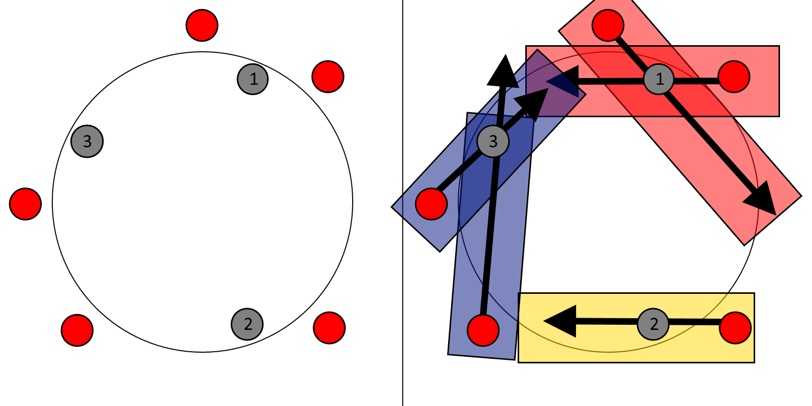
*Assume the top of the image is North of the arena. Spots (1), (2), and (3) represent divebomb bait spots. A bait spot can be placed next clockwise to two dragons (as shown in safe spot (3)). or between two dragons as shown in safe spot (1)). Dives are significantly wider than shown here.*

> Baiting the second divebomb marker is where people have the most difficulty, due to Nael throwing out her Hypernovas during this phase.  As a divebomb marker, you can make this a little easier by always placing the second bait spot clockwise of the 3rd dragon, and having players dodge Hypernovas clockwise. 

During divebomb baiting, Nael will be throwing out Hypernovae at the furthest targets from her, which ideally should be the people baiting divebombs. Make sure the divebomb marker over your head disappears before moving away to dodge Hypernovae. If possible, always dodge Hypernovae by moving clockwise.

Nael will also say her 4th quote, determining whether she will do Meteor Stream
→ Dalamud Dive (***"Fleeting light! Amid a rain of stars, exalt you the red 
moon!"***), or Dalamud Dive → Thermionic Beam (***"Fleeting light! 'Neath the red
moon, scorch you the earth!"***). This determines whether you should spread out
during this phase, to avoid doubling up on Meteor Streams, or to stack together
and soak Thermionic Beam. Make sure that nobody is near the main tank, as Dalamud
Dive's splash damage will be lethal to anyone that is not a tank. Meteor Streams
will occur during the second divebomb, so make sure the party is spread out away
from the second waymark. If Divebombs have been marked correctly, the center will
always be safe, making it the perfect stack point for Thermionic Beam.

After all divebombs are resolved, dragons will no longer do any actions for the rest of the phase, so you no longer have to worry about Iceballs, Fireballs, Thunderstruck, Doom, or Wings of Salvation. Nael will follow up with another set of Bahamut's Claws, and proceed to say two more quotes. These quotes can be any of the previously seen quotes (excluding divebomb quotes), so be ready for anything. Nael will then follow with a Ravensbeak, forcing a tank swap, and attacking her new target with a set of Bahamut's Claws. Shortly after, she will become untargettable, and begin casting a lethal Megaflare, wiping the raid and serving as an enrage.

After Nael is killed, she will jump away, signifying the end of Phase 2. This phase can be pushed before her rotation is complete. Be sure to prepare mitigation and stack together once more to prepare for this phase transition.

<blockquote>

**Rotation**

* Dalamud Dive
* Bahamut's Claw
* Bahamut's Favor

**Dragons Spawn**

* 2 Thunders + Lunar Dynamo
* Fire Tether
* Nael Quote 1
  * if nael says ***"O hallowed moon, take fire and scorch my foes!"***
— Lunar Dynamo → Thermionic Beam
  * if nael says ***"O hallowed moon, shine you the iron path!"***
— Lunar Dynamo → Iron Chariot
* 2 Doom + Light Puddle dance
* Bahamut's Claw
* Fire Tether 
* 2 Thunders
* Nael Quote 2
  * if nael says ***"Blazing path, lead me to iron rule!"***
— Thermionic Beam → Iron Chariot
  * if nael says ***"Take fire, O hallowed moon!"***
— Thermionic Beam → Lunar Dynamo 
* 3 Doom + Light Puddle dance
* Fire Tether 
* Bahamut's Claw
* Nael Quote 3
  * if nael says ***"From on high I descend, the iron path to call!"*** or ***"From on high I descend, the iron path to walk!"***
— Raven's Dive → Iron Chariot
  * if nael says ***"From on high I descend, the hallowed moon to call!"***
— Raven's Dive → Lunar Dynamo
* 2 Thunders
* Fire Tether 
* 3 Doom + Light Puddle dance
* Ravensbeak
* Divebomb marker 1
* Hypernova
* Divebomb marker 2
* Hypernova
* Divebomb marker 3
* Nael Quote 4
  * if nael says ***"Fleeting light! 'Neath the red moon, scorch you the earth!"***
— Dalamud Dive → Thermionic Beam
  * if nael says ***"Fleeting light! Amid a rain of stars, exalt you the red moon!"***
— Meteor Stream → Dalamud Dive
* Dive 1
* Nael Quote 4 skill 1
* Dive 2
* Nael Quote 4 skill 2
* Dive 3

**Dragons Withdraw**

* Bahamut's Claw
* Nael Quote 5 → Nael Quote 6
  * Can be any of the previously said quotes.
* Ravensbeak
* Bahamut's Claw
* Megaflare (Enrage)

</blockquote>

The transition to Phase 3 begins with **Seventh Umbral Era**, a raid-wide AoE
dealing damage and doing a knockback, very similar to Heavensfall. There will
then be a set of 3 **Calamitous Flames**, followed by a **Calamitous Blaze**,
which is just raid-wide damage to the whole party.  **Calamitous Blaze cannot
be survived without a Tank LB, with a Tank LB3 being heavily preferred.** In
order to effectively mitigate these, have one of your tanks use Tank LB as soon
as you get knocked back by Seventh Umbral Era. (A tank LB2 should be popped before
the first hit, as it has a longer duration.)

## Phase 3: Bahamut Prime
### Bahamut's Abilities:

* **Flare Breath**: Conal cleave dealing very significant magic damage. Treat it
like a mini-tankbuster.
* **Flatten**: Physical tankbuster dealing massive physical damage, that must be
mitigated.
* **Earth Shaker**: Bahamut will place a marker over a party member, targetting
them with a huge conal AoE between Bahamut and his target (The range is
approximately a full 90 degree slice of the arena). Deals significant physical
damage, and leaves a fire puddle (not unlike Liquid Hell puddles). Standing in
the puddle will inflict Sludge, a heavy and severe dot that will likely kill you.
* **Tempest Wing**: A tether will extend from Bahamut to a random target. This
tether can be intercepted by standing between Bahamut and it's target. Deals
magical spash damage that knocks back and stuns any party member except it's target.
* **Megaflare**: 2+ players will get marked by a circle surrounding them,
indicating them to stack. Splash damage will target random players, so everyone
must spread out. Players without splash damage must not get hit by another player's
splash damage, as they likely will likely either die, or not have enough HP to
survive a later mechanic. AOE circles will also appear on the ground to dodge.
* **Gigaflare**: Raid-wide AoE dealing massive magic damage.

Bahamut's phase consists of small periods to do damage divided up by large
intermissions called Trios. Throughout these trios, Nael, Bahamut, and
Twintania will all do a combination of their mechanics at the same time.

The phase begins with Bahamut quickly using a **Flare Breath**, immediately
followed by a **Flatten**. Afterwards, Bahamut will summon Nael and
Twintania, and begin Quickmarch Trio.

## Quickmarch Trio

* Bahamut + Nael + Twin Line Divebomb
* Twister + Dodge Dives
* Megaflare (3 DPS) + Earth Shaker (2 healers 1 DPS) + Tempest Wing

Nael, Bahamut, and Twintania will all appear in a line on the edge of the arena,
and will dive across the middle of the arena. This leaves two safe spots in the
edges of the arena. Assign each player an assigned position in either the left
or right safe spot, and get ready to move to avoid twisters as soon as the trio
dive (I'd highly recommend using Focus Target to see when the cast finishes, as
that's when you have to move. The enemy list also shows the end of the cast).
Immediately afterwards, **Megaflare** begins, marking three random DPS with
circles around them, while hitting four random players with unavoidable soak
damage, so you must be spread out. Keep in mind players can be targetted by
both Megaflare circles and Megaflare splash damage. At the same time, both
Healers and the non-marked DPS will recieve an **Earth Shaker** marker over
their heads, and two random players will be tethered to Bahamut via **Tempest
Wing**.

The best way to deal with this trio is to assign mechanics to a quadrant of the
arena. We had our Megaflare stack in the south, in max melee range of the boss,
and each healer was assigned east or west, accompanied by a tank to intercept
the tether. The last DPS with Earth Shakers would go north. Have your tanks
intercept the Tempest Wing tethers and position themselves in front of the two
healers, regardless of if they'll be hit by Earth Shaker, as it does menial
damage to tanks. After this, the first Trio is resolved. 

[Here's a helpful toolbox](https://ff14.toolboxgaming.space/?id=631927850082161&preview=1)
of how Aether PUGs handle Quickmarch, courtesy of Lily Coffeebean@Cactuar (Lily#0601).

A diagram is shown
below:

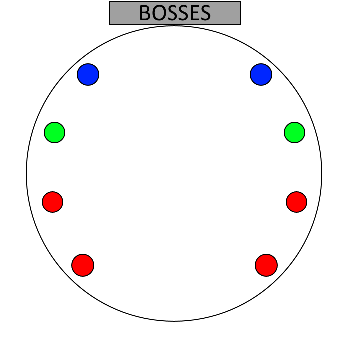
*Initial positions. They don't have to be as shown here.*

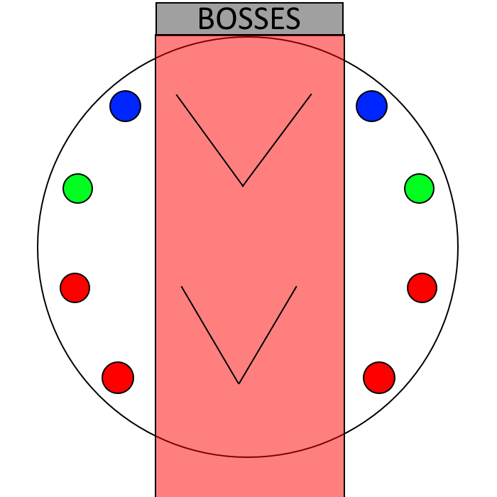
*This dive is very wide, so be wary.*

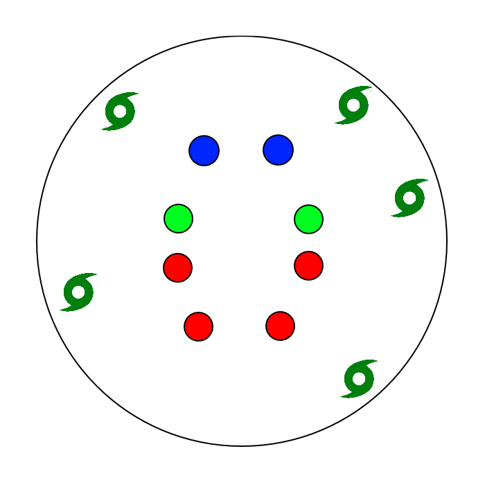
*Immediately after the cast ends, be sure to run away from the edges to avoid
twisters. Not shown are Megaflare AoEs.*

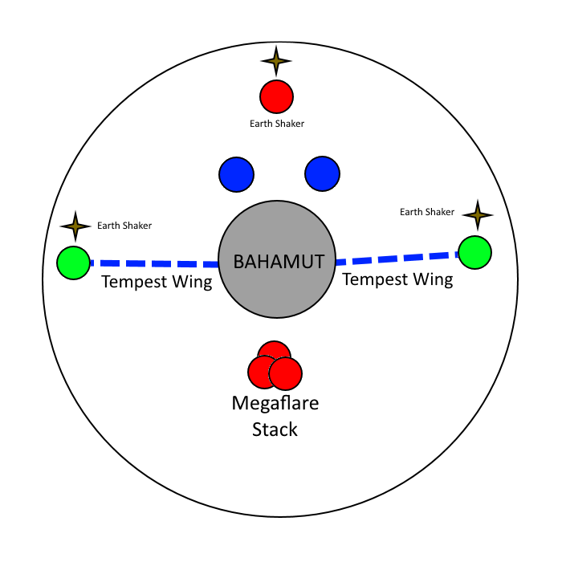
*Tempest Wing tethers don't have to be on healers, they can also be on the Earth
Shaker DPS.*

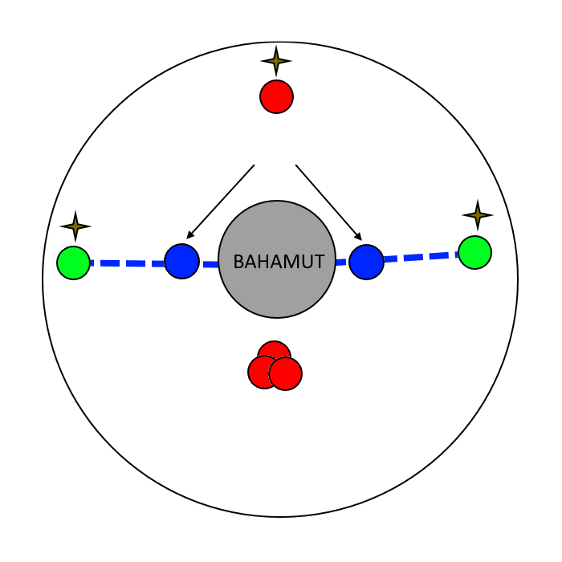
*Have tanks intercept tethers, regardless of if they will be hit by Earth Shakers.*

*Earth Shaker is very wide, so be wary.*

<button aria-label="Previous" class="glider-prev">«</button>
<button aria-label="Next" class="glider-next">»</button>

After Quickmarch Trio resolves, Bahamut will repeat the same Flare Breath into
Flatten combo done earlier. Once again, Bahamut will summon Nael and Twintania
and begin using Blackfire Trio.

## Blackfire Trio

* All three bosses appear in a triangle outside the arena.
* Liquid Hell + Divebomb marker
* Thermionic Beam — Comes out during the fourth liquid hell, everyone has to
move together
* Megaflare markers (1 tank 1 healer 2 dps) + 4 pillars
* 4 Hypernovas

This trio begins with a Bahamut divebomb marker appearing over a random
player's head. Bahamut's markers work differently than the elemental dragons in
the earlier phase, in which Bahamut will dive to where the marker appears, not
disappears, so you must bait beforehand. During this time, Twintania will be
targetting a random player with Liquid Hells, and Nael will be using Thermionic
Beam (during the fourth Liquid Hell). You must be stacked together in movement,
making sure nobody receives the burns from puddles left behind.

There are two main strategies to deal with the first part of Blackfire Trio,
which I will call the edge method and the center method.

### Edge

*Edge Method*

Begin the trio stacked together as a party in the wall, and find Bahamut. Move
along the arena away from Bahamut (i.e. if the party is at 6 o'clock, and
Bahamut is at 10 o'clock, move counterclockwise). In the event that Bahamut
spawns directly in front or behind the stack, moving in either direction is
fine, but I'd recommend assigning a default. Move along the wall, making sure
nobody gets Burns from Liquid Hell.

### Center

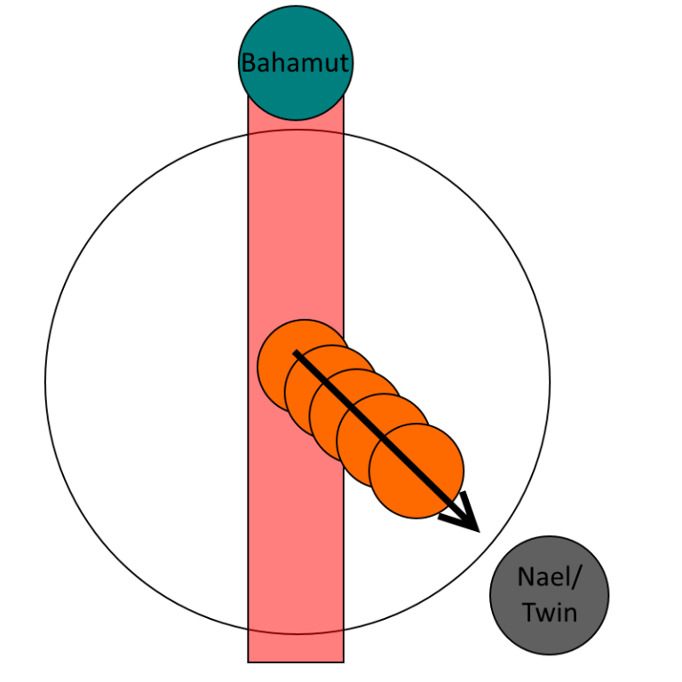
*Center Method*

Begin the trio stacked together as a party in the center of the arena, and find
Twintania or Nael (either can be used as a waymark, just make sure everyone
uses the same one). Move toward Twintania or Nael's spawn, to make sure the
party remains stacked. Be sure to make very small stutter-steps to make sure
you don't reach the wall before all five Liquid Hell puddles are placed, but
not slow enough so that people are inflicted with Liquid Hell's burns. As long
as you just move to the edge of the Liquid Hell puddle every time, you should
be fine.

> The Edge method requires slightly more thought but removes a line of Liquid Hell puddles that may block off movement. The Center method, however, requires virtually no thought. Choose a strategy that better fits your team.

Immediately after the fifth Liquid Hell, Nael will mark 2 random DPS, 1 random
healer, and 1 random tank with Megaflare circles. All Megaflare marked players
should stay stacked together where the party finished moving. At the same time,
four pillars will appear in each quadrant of the arena, forming a square. These
towers spawn based on Bahamut's location (i.e if Bahamut is north, towers will
spawn in North, East, South, and West). A player must be inside a tower when it
explodes, or it will deal raid-wide lethal damage. This is where unmarked
players come in. Assign one tower to be the unmarked healer's tower, one tower
to be the unmarked tank's tower, and have your remaining 2 unmarked DPS spread
out into the remaining towers. It doesn't matter which tower each player is
sent to, but I'd recommend your healers and tanks have an assigned tower on one
half of the arena, and have your DPS towers on the other half of the arena,
calling to go either close or far. Nael will be using Hypernovas before towers
explode, so you must bait them outside the towers. You're safe to move into the
towers after the second Hypernova, so wait until you see it before moving in.

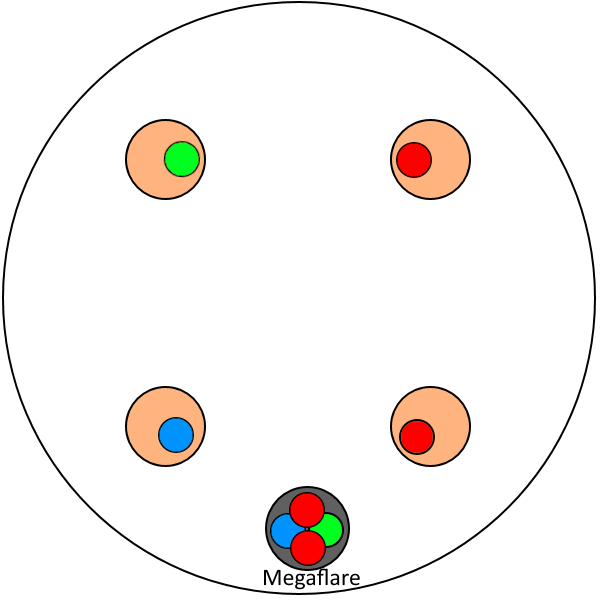
*These tower sets do not have to be followed exactly. In the event that your
finished position after the dive is near a tower location, I'd recommend
defaulting clockwise to follow this diagram.*

[Here's a helpful toolbox](https://ff14.toolboxgaming.space/?id=731924771082161&preview=1)
of how Aether PUGs handle Blackfire, courtesy of Lily Coffeebean@Cactuar (Lily#0601).

Immediately after Blackfire Trio, Bahamut will begin casting **Gigaflare**, so
make sure to mitigate appropriately. Bahamut will follow up with 3 Flare
Breaths in a row, and once again summon the other bosses and begin Fellruin
Trio.

## Fellruin Trio

* All 3 appear closer to the middle, in a triangle formation. Their location is random.
* Nael uses a random RP attack. All 3 neurolinks need to be used. Party on one,
MT on one, OT on one. Tanks need to pick up tethers. Need to be in neurolinks
by aetheric profusion.
  * If Nael says ***"From on high I descend, the moon and stars to bring!"***
— Raven's Dive → Lunar Dynamo → Meteor Stream
  * If Nael says ***"From hallowed moon I descend, a rain of stars to bring!"***
— Lunar Dynamo → Raven's Dive → Meteor Stream
* Tempest Wing x2
* Aetheric Profusion (needs Neurolink)
* Meteor Stream

The trio begins with Nael, Bahamut, and Twintania appearing in a triangle
formation around the middle of the arena. Their location in the triangle is
random. Nael begins by saying one of two quotes, corresponding to either
Raven's Dive → Lunar Dynamo (***"From
on high I descend, the moon and stars to bring!"***) or Lunar
Dynamo → Raven's Dive (***"From
hallowed moon I descend, a rain of stars to bring!"***). I'd
recommend using the same assigned positions as used in the earlier Ravan's
Dive's combo in Phase 2, surrounding Nael. After Nael's first move, Bahamut
will tether two random players with Tempest Wing, which each tank must
intercept and pick up. Very shortly after, Twintania will use Aetheric
Profusion. Your party must use one neurolink, while your tanks use the other
two neurolinks to avoid the knockback from Tempest Wing. Immediately after
Aetheric Profusion resolves, Nael will use Meteor Stream, so your party must
spread out as fast as possible.

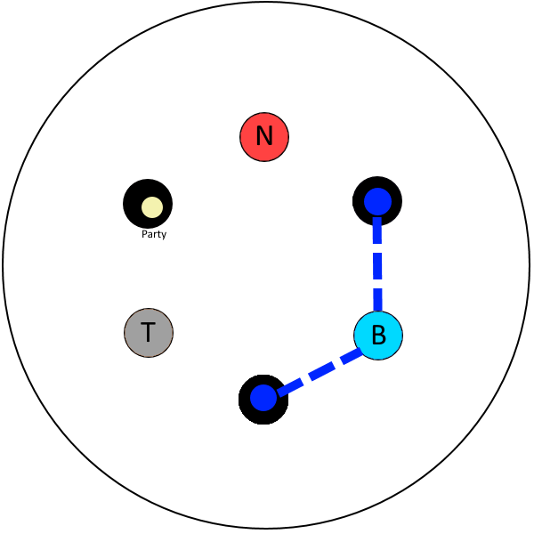
*Black circles indicate neurolinks, while blue lines indicate tempest wings.
Keep in mind Nael, Bahamut, and Twintania's locations are in a random
configuration.*

[Here's a helpful toolbox](https://ff14.toolboxgaming.space/?id=831921602082161&preview=1)
of how Aether PUGs handle Fellruin, courtesy of Lily Coffeebean@Cactuar (Lily#0601).

This trio is immediately followed by a Gigaflare, so make sure to heal and
mitigate appropriately. Afterwards, Bahamut will use a Flare Breath, followed
by a Flatten, followed by another Flare Breath. Afterwards, Bahamut summons the
bosses again and begins Heavensfall Trio.

## Heavensfall Trio

* Bahamut + Nael + Twin appear at the edge of the arena.
* Bahamut Divebomb Marker + Twintania Divebomb Marker
* Twister
* Megaflare + 8 Towers spawn (on the edge)
* Heavensfall (rotating circle type) + 3 Hypernovae
* Fireball Stack

The trio begins with Bahamut, Nael, and Twintania jumping to a random edge of
the arena. They will always be adjacent to each other, but in a random position
(i.e. You may see from left to right **[Bahamut, Nael, Twintania]** or **[Nael,
Bahamut, Twintania]**, or any other combination of the three). Begin by
stacking in the middle, to bait Bahamut and Twintania's dives. There are two
ways to dodge dives, depending on Nael's position in their configuration.

### If Nael is not in the middle

Dodge this almost exactly like Quickmarch Trio's dive, using the same safe spots.

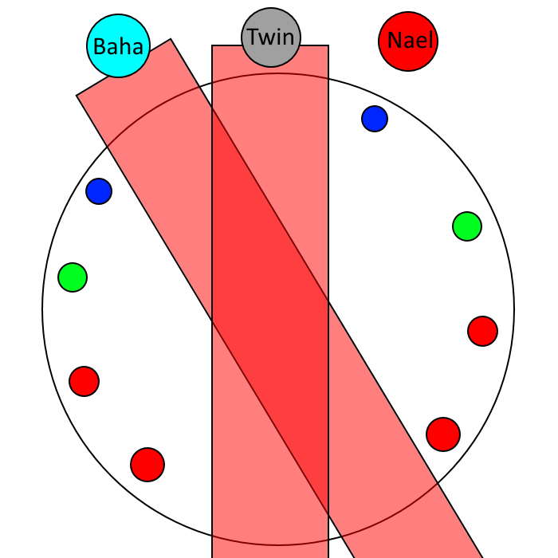
*This configuration can also be mirrored, so be wary.*

### If Nael is in the middle

Have two players dodge toward the north quadrant, two players to the east, two
players to the south, and two players to the west, You can use the same safe
spots as Quickmarch trio, albeit with small differences. Your members who are
the furthest north should just move to the north quadrant, and the southernmost
players should move toward the south quadrant. all other players should have
the same safe spots.

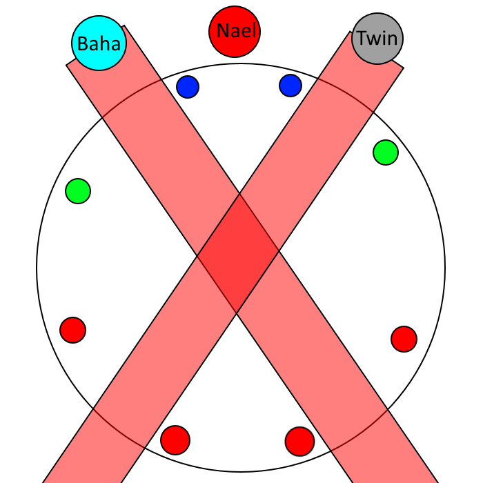

> You can squeeze 4 people inbetween Bahamut and Nael's dives and not change
> positions, but it's a tight fit.

Immediately after dives, Twintania will follow up with a Twister, and Bahamut
will spawn 8 towers in random areas across the edge of the map. After a short
while a Heavensfall will drop. Your goal is to have all 8 players use the
Heavensfall knockback to knock themselves into each of the 8 towers. In order
to quickly determine what player should go to what tower, I'd recommend using
Nael as a waymark (12 o'clock) and assigning each player a number,
corresponding to which tower they should take starting clockwise (i.e. player
#1 would take the first tower going clockwise, player #2 would take the second
tower going clockwise, etc etc). You can use Quickmarch trio safe spots as a
basis to determine what number should go on what player.

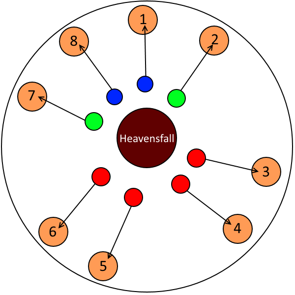
*Players who are 5-8 can instead remember themselves as 1-4 going
counter-clockwise, if that's easier to identify.*

After towers resolve, get ready to actually dodge Thermionic Burst aoes caused
by Heavensfall. While you are dodging, Nael will throw out 3 Hypernovae
targetted at 3 random party members, so be sure to bait these at the wall if
possible. After the 3rd Hypernovae, when Heavensfall resolves, a random player
will be marked with a fireball marker. Have your party quickly collapse in the
middle to soak Fireball, and prepare mitigation for the upcoming Gigaflare.

> Some groups may decide to just sacrifice the Fireball marked player, and
> forego all damage caused by it. This should only be done if you have less
> than 6 people up, and desperately need to recover.

[Here's a helpful toolbox](https://ff14.toolboxgaming.space/?id=931929042082161&preview=1)
of how Aether PUGs handle Heavensfall, courtesy of Lily Coffeebean@Cactuar (Lily#0601).

Immediately after Heavensfall Trio, Bahamut will use Gigaflare, followed by 3
Flare Breaths. Afterwards, Tenstrike Trio will begin.

## Tenstrike Trio

* Triple Generate
* Meteor Stream x4 (4dps)
* Triple Generate (on same targets)
* Meteor Stream x4 (2 healers 2 Tanks)
* Earth Shakers x4
* Earth Shakers x4

This trio begins with Twintania appearing in the middle, and targetting 3
random players with Generate, this time sending two hatches at each targeted
player. In order to prevent a wipe, you must have another set of 3 players
intercept the second hatch by standing in the neurolink. At the same time, Nael
will also be using Meteor Streams on everyone, one by one. She will always dive
on all 4 DPS first, followed by 2 healers, followed by 2 tanks. I'd recommend
having all players spread out to pre-assigned positions (cardinals and
intercardinals) and have each of the marked players move into each of the
Neurolinks. You can use your quickmarch positions for this, and they'll work
pretty well. Keep in mind, **you cannot run through the middle of the arena, as
Hatches are present.** At the same time, have unmarked players call which
player's hatch they will be intercepting, and move into the corresponding
neurolink after the first hatch is resolved.

*I'd recommend calling out which waymark targetted people are going to. If
nothing's changed, waymarks should still be present.*

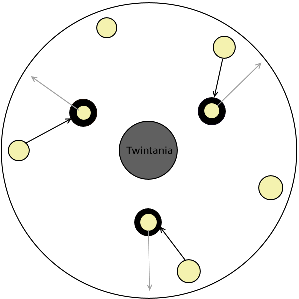
*Make sure to have marked players move directly toward the back, as they are
still being targetted for hatches.*

*In the case that two people go to the same neurolink, I'd recommend you both
stay in, as its not lethal for two players to take a neurolink.*

<button aria-label="Previous" class="glider-prev">«</button>
<button aria-label="Next" class="glider-next">»</button>

Immediately after, 4 players will be marked with Earth Shaker markers. Players
must spread out to 4 different sides of the arena, making sure no Earth Shaker
hits any other and a safe spot is left for the remaining 4 players. The second
set of 4 players should be quickly discussing what position they will be going
for the second set of Earth Shaker markers, which will appear shortly after the
first set resolves.

> A common strategy is to mark the safe spot with a square marker [marker 1 or
> 2], and have each of the remaining 4 players stand in each of the corners of
> the waymark. This is a quick way to non-verbally determine what spots people
> should be going, allowing voice coms to be dominated by the first set of
> Earth Shakers. I highly recommend using this square marker technology.

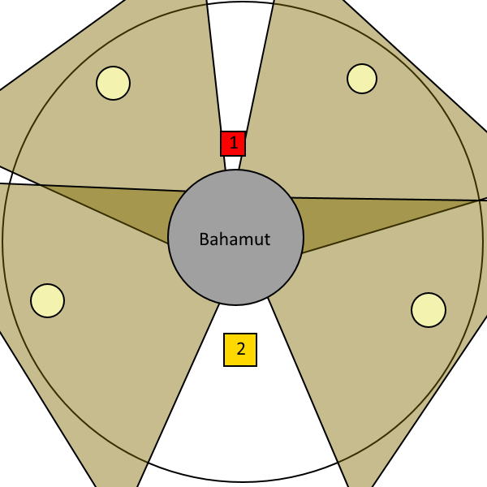
*Make sure to keep the 2 waymark open, as a safe zone.*

*Using the corners of the square 2 marker, quickly decide what direction you'll
place the second set of shakers.*

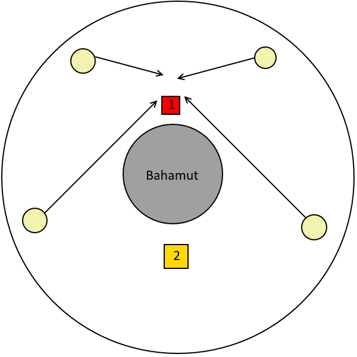
*First set of shakers should run toward 1, a new safe spot.*

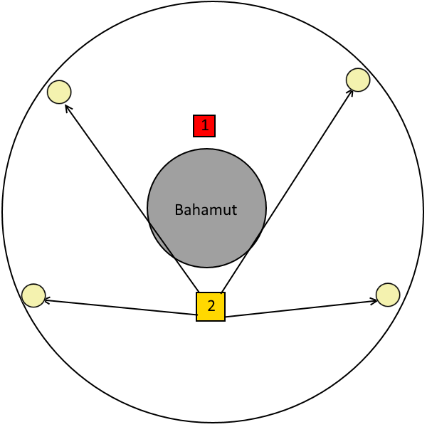
*Second Earth Shakers should move to where previously decided, leaving 1 as a
safe zone.*

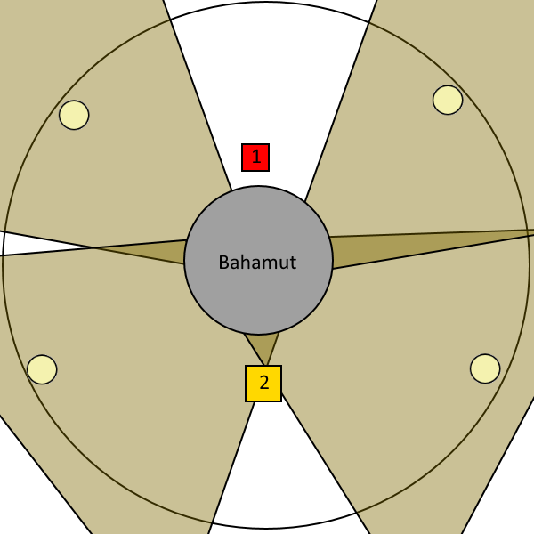
*If all is done correctly, nobody should be doubled by Earth Shakers.*

<button aria-label="Previous" class="glider-prev">«</button>
<button aria-label="Next" class="glider-next">»</button>

[Here's a helpful toolbox](https://ff14.toolboxgaming.space/?id=041924092082161&preview=1)
of how Aether PUGs handle Tenstrike, courtesy of Lily Coffeebean@Cactuar (Lily#0601).

After this trio resolves, Bahamut will once again cast Gigaflare, followed by a
Flatten into Flare Breath, and then following into Grand Octet.

> If Bahamut is not pushed under 60% by the completion of Grand Octet, Bahamut
> will gain a buff in the last phase causing him to deal unhealable damage,
> resulting in a wipe at that phase. You can still practice Teraflare, though.

## Grand Octet

* 5 dragons and 3 bosses spawn in 8 set locations randomly
* If everyone is alive during the Grand Octet cast, each player will be marked
once, and only once.
* Nael dives first
* 5 Dragons dive in succession
* Bahamut dives
* Twintania dives + Megaflare Stack + Megaflare Towers

There are a multitude of strategies to correctly preform Grand Octet. The
strategy I present is one of many, but I think it's the easiest and most
consistent strategy out of the ones I've found/thought of. Whenever 'dragons'
are mentioned, this does not include Twintania, Nael, or Bahamut.

Here are the basic rules of Grand Octet (ty aya liz):

* The 8 locations dragons/bosses can spawn is always set, but their
configuration is random.
* Nael will always be the first to dive. Her position is locked where the marker
APPEARS.
* 5 Dragons will dive depending on Bahamut's position. Twintania will always be
skipped. Their position is locked when the marker DISAPPEARS.
  * If Bahamut is in a cardinal position, dragons will dive in a
counter-clockwise order, starting from Bahamut's counter-clockwise side.
  * If Bahamut is in an intercardinal position, dragons will dive in a
clockwise order, starting from Bahamut's clockwise side.
  * If Twintania is between 2 dragons, she will be skipped.
* After all 5 dragons dive, Bahamut will dive. His position is locked when the
marker APPEARS.
* Twintania will dive last, her position being locked when the marker APPEARS.
Megaflare will begin at the same time.

Begin the phase by stacking in the middle. Determine where Bahamut is, and take
note if he's at an intercardinal or a cardinal position. Also check to make
sure Nael is not across the arena, opposite Bahamut. If Nael is not opposite
Bahamut, wait for the initial divebomb marker to appear, and then run to the
dragon opposite Bahamut. After Nael dives, you will begin running in a circle.
If Bahamut was at a **CARDINAL** position, you will be running
counter-clockwise (Diagram 1 &amp; 2 shown below). If Bahamut was at an
**INTERCARDINAL** position, you will be running clockwise (Diagram 3 &amp;
4 shown below). Do not sprint until all divebomb markers appear, unless you're
behind the party. Once the red Bahamut dive marker appears, run straight to the
middle.

*Numbers indicate the order dragons dive. After dive markers appear, move
opposite Bahamut.*

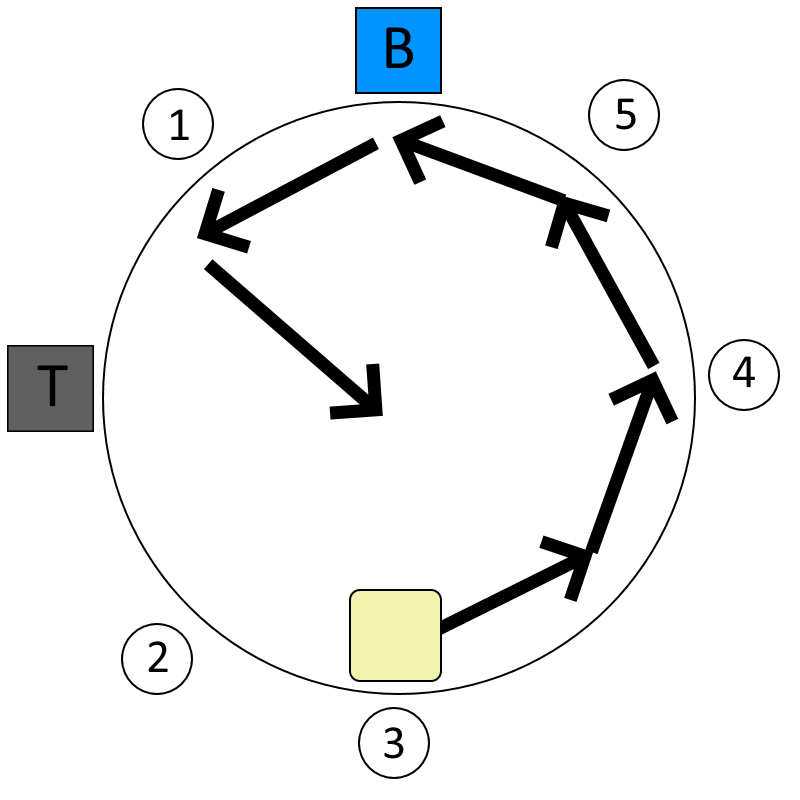
*When Nael dives, begin moving counter-clockwise along the wall, as Bahamut is
at a cardinal. When the red Bahamut marker appears, run to the center.*

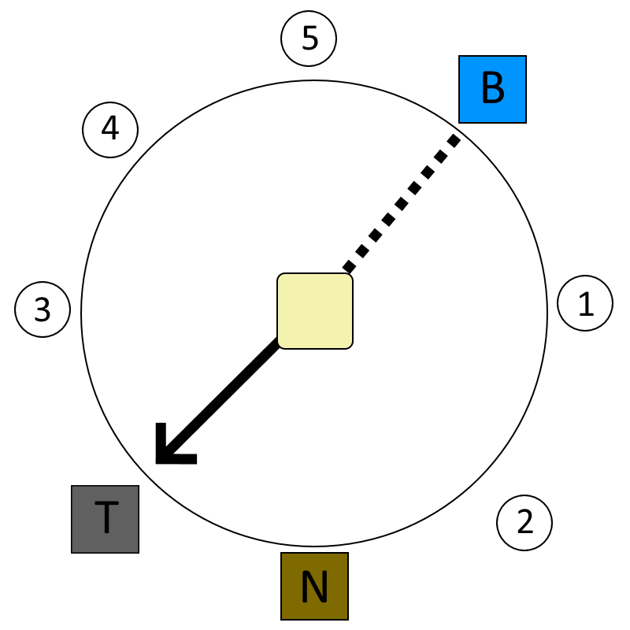
*Numbers indicate the order dragons dive. After dive markers appear, move
opposite Bahamut.*

*When Nael dives, begin moving clockwise along the wall, as Bahamut is in an
intercardinal. When the red Bahamut marker appears, run to the center.*

<button aria-label="Previous" class="glider-prev">«</button>
<button aria-label="Next" class="glider-next">»</button>

**In the event Nael is directly across from Bahamut:** If Bahamut was at
a **CARDINAL** position, wait for the first divebomb marker to appear, and then
run to the first dragon counter-clockwise Nael (Diagrams 1 &amp; 2 shown
below). If Bahamut was at an **INTERCARDINAL** position, wait for the first
divebomb marker to appear, and then run to the first dragon clockwise Nael
(Diagrams 3 &amp; 4 shown below). The strategy then plays out exactly as
outlined previously.

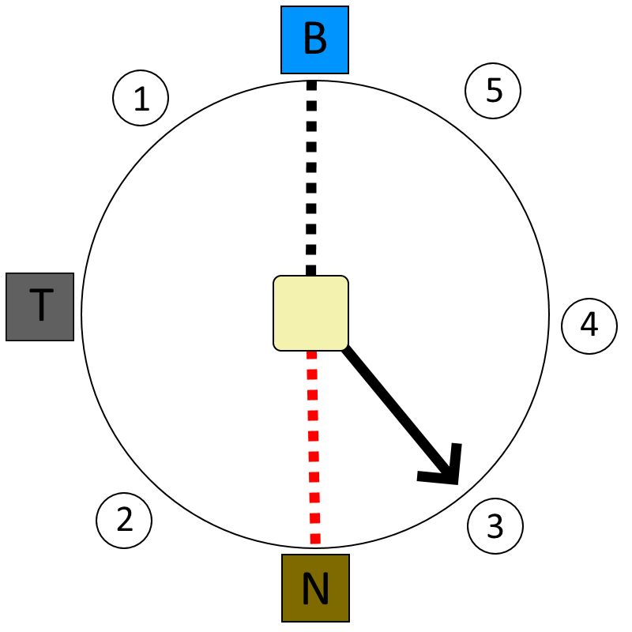
*Nael is across Bahamut, and Bahamut is at an cardinal, so run toward the first
dragon counter-clockwise of Nael after markers appear.*

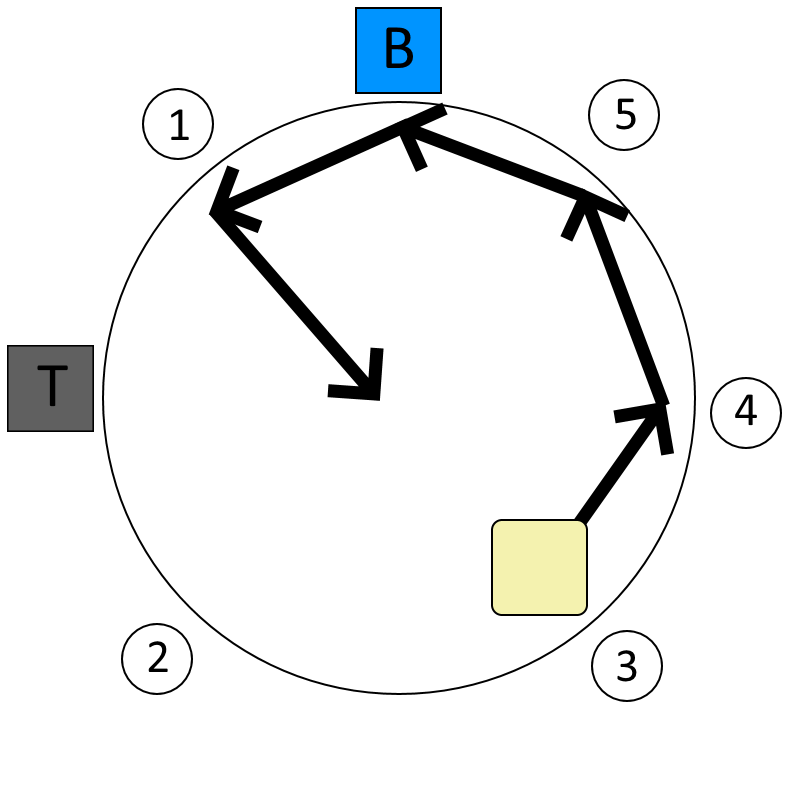
*After Nael dives, simply run in a circle, identially to the previous strat.
When Bahamut's red marker appears, run toward the middle.*

*Nael is across Bahamut, and Bahamut is at an intercardinal, so run toward the
first dragon clockwise of Nael after markers appear.*

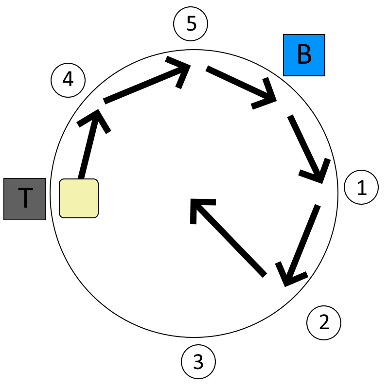
*After Nael dives, simply run in a circle, identially to the previous strat.
When Bahamut's red marker appears, run toward the middle.*

<button aria-label="Previous" class="glider-prev">«</button>
<button aria-label="Next" class="glider-next">»</button>

After all dives except for Twintania are resolved, there should only be 1
player who has not been marked by any dragon. Have them run to the right of
Twintania, to bait her dive. At the same time, Megaflare Towers and markers
will appear on random players. The player marked by Twintania can be selected
for either mechanic, so they must be prepared to deal with either mechanic. For
ease of access, have your Megaflare stack be on the left of Twintania, and have
the tower closest to Twintania be for the player targeted by Twintania if they
do not have a Megaflare marker. Your remaining members should be taking towers.
There's no foolproof method I can think of that makes this tower set easy, so I
recommend just calling out which tower you're going to and adjust on the fly.
Immediately after the dive, Twintania will begin using Twister, so players
inside towers must run inside them as to not trigger Twisters, and players in
the Megaflare stack should move out.

Megaflare will similarly target 1 healer, 1 tank, and 2 dps, which means you
can have a general priority system to who goes to which tower. You can usually
get away with just winging it, but I wouldn't recommend enforcing a priority
system because of the need of having a tower open, as the Twintania bait might
have to take a tower.

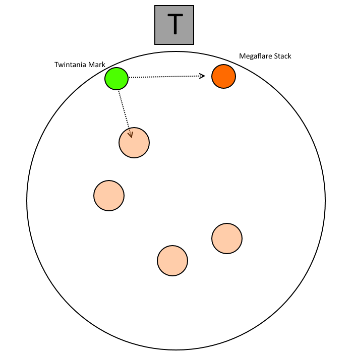
*Keep in mind tower locations are in RANDOM locations along a smaller circle in
the center of the arena, so they will not always be in this configuration.
There are 8 possible locations where towers can spawn.*

If you're confident in your adds phase DPS, you can instead opt to Tank LB3
approximately a second before Megaflare towers spawn to avoid having to
coordinate the towers and Megaflare stack after Octet's dives. Make sure the
tank who is LBing is in the middle of the arena and prepared to move for
twisters. You still have to place Twintania's dive, but this completely
nullifies the damage done by Megaflare, allowing any player to take any tower,
regardless of if they have any marker. You still have to move to avoid
twisters, so be wary.

> In the case of a tank LBing having to position Twintania's dive (i.e. you
> have a death going into Grand Octet), you will need a healer ready to rescue
> the tank as soon as the Twintania dive marker appears.

[Here's a helpful toolbox](https://ff14.toolboxgaming.space/?id=141922153082161&preview=1)
of how Aether PUGs handle Grand Octet, courtesy of Lily Coffeebean@Cactuar (Lily#0601).

Immediately after Grand Octet is complete, Bahamut will immediately jump to the
background of the arena, and begin charging **Teraflare**.

<blockquote>

**Rotation**

* Flare Breath
* Flatten
* **Quickmarch Trio**
* Flare Breath
* Flatten
* **Blackfire Trio**
* Gigaflare
* Flare Breath x3
* **Fellruin Trio**
* Gigaflare
* Flare Breath
* Flatten
* Flare Breath
* **Heavensfall Trio**
* Gigaflare
* Flare Breath x3
* **Tenstrike Trio**
* Gigaflare
* Flatten
* Flare Breath
* **Grand Octet**

</blockquote>

## Phase 4: Teraflare (Adds)

* Nael and Twintania become targetable. 
* One tank per boss. Can be tanked back to back.
* Duty Gauge for an ultimate attack. 100 = wipe.
* Need to kill both bosses at roughly the same time, as upon death
the other casts their ultimate. (Twintania: Twin Fury &amp; Nael: White Fury)

The phase begins with Bahamut charging Aethertrail Attunement in the duty
gauge, and Nael and Twintania becoming targetable, spawning at 45% and 40% HP
respectively. They have all the same abilities they had in the earlier phases.
They share the same enmity table as Bahamut. Have the tank who wasn't tanking
Bahamut provoke one of the two bosses off the other. They can both be tanked in
the same place, stacked on each other.

*General positioning during adds phase. As long as the bosses are tanked
roughly between two neurolinks as shown, you'll be fine.*

Have a players in position to bait Liquid Hells (ideally the same player who
baited in Phase 1). I recommend placing a waymark down somewhere (ideally a
location easily reachable by everyone) to use as an indicator of where to soak
Thermionic Beam, and assigned positions to spread for Raven's Dive. Keep in
mind the bosses must die at the same time, or they will cast Twin Fury/White
Fury, fully healing the boss and giving them a damage up, as well as a
vulnerability down. This is essentially a raid wipe. (you have a grace period
of ~3 seconds).

The bosses will both begin by using their mini-busters (**Plummet** for
Twintania, **Bahamut's Claw** for Nael). Twintania will then do her baitable
Liquid Hells, identical to the ones in Phase 1. She will immediately follow up
with a **Generate** + **Twister** combo, this time targetting 3 random DPS. As
you have 3 neurolinks, each hatch must go in one and only one neurolink.

Assign a neurolink to each of the melee (one takes left flank, one takes right
flank), one to the ranged, and have the second ranged be a floater. If you're
soaking Hatch on a melee neurolink, you can bait twisters **AFTER** resolving
Hatch. If you are using the ranged neurolink, bait your twister **BEFORE**
resolving Hatch. Of course, use your best judgement if positioning is not
perfect.

Immediately after Twister resolves, Nael will say one of 4 quotes:

* ***"From hallowed moon I descend, upon burning earth to tread!"***
— Lunar Dynamo → Raven's Dive → Thermionic Beam
* ***"From hallowed moon I bare iron, in my descent to wield!"***
— Lunar Dynamo → Iron Chariot → Raven's Dive
* ***"Unbending iron, take fire and descend!"***
— Iron Chariot → Thermionic Beam → Raven's Dive
* ***"Unbending iron, descend with fiery edge!"***
— Iron Chariot → Raven's Dive → Thermionic Beam

> If Nael's quote indicates her first move to be Lunar Dynamo, then when the
> cycle repeats she will always say a quote indicating Iron Chariot, and
> vice-versa.

Nael will very quickly cycle through her 3-move rotation. Keep in mind
Twintania is still using auto attacks, so take special care of your Twintania
tank. Immediately after Nael finishes her rotation, Twintania will use another
Twister, so make sure to dodge it. Nael will then follow up with a
**Megaflare**, dealing a lot of raid-wide magic damage with must be mitigated.
After Megaflare resolves, both Twintania and Nael will use their respective
tankbusters (**Death Sentence** and **Ravensbeak**), which still inflict either
a slashing or a piercing vulnerability, and therefore still force a tank swap.
The easiest way is to just have each tank provoke the boss off of the other.
You do not need to shirk each other.

Their rotation will then repeat once, all the way until after the final
Twister. Instead of Nael starting off with the Megaflare, the bosses instead
will use their tankbusters first, and then follow up with the Megaflare. You
have these 2 cycles before Aethertrail Attunement reaches 100, causing a raid
wipe. I'd highly recommend saving a caster or ranged Limit Break, in order to
kill both bosses at the same time.

If Aethertrail Attunement is lower than 100 when you kill Nael and Twintania,
Teraflare will still 'kill' you. However, Phoenix will cast Flames of Rebirth
and revives you with full HP, no weakness, full LB3, and the buff **Phoenix's
Blessing**. This buff doubles all damage dealt by players. However, **this
buff does not persist across death**, so staying alive throughout this last
phase is imperative to kill before enrage. You will have no statuses on you
when you raise (i.e. no protect, etc), so make sure you take care of that
during the small downtime you get before Golden Bahamut is targettable.

> Note that if you were dead with weakness, or finish Teraflare with weakness,
> your weakness timer will reset. Consider not rezzing a player who died at the
> very end of Teraflare so they don't gain a refresh on weakness, as all
> players will be raised regardless.

<blockquote>

**Rotation**

* Twintania: Plummet + Nael: Bahamut's Claw
* Twintania: Liquid Hell (Distance)
* Twintania: Generate x3
* Twintania: Twister
* Nael: Quote
  * if ***"From hallowed moon I descend, upon burning earth to tread!"***
— Lunar Dynamo → Raven's Dive → Thermionic Beam
  * if ***"From hallowed moon I bare iron, in my descent to wield!"***
— Lunar Dynamo → Iron Chariot → Raven's Dive
  * if ***"Unbending iron, take fire and descend!"***
— Iron Chariot → Thermionic Beam → Raven's Dive
  * if ***"Unbending iron, descend with fiery edge!"***
— Iron Chariot → Raven's Dive → Thermionic Beam
* Twintania: Twister
* Nael: Megaflare
* Twintania: Death Sentence + Nael: Ravensbeak

Cycle 2:

* Twintania: Plummet + Nael: Bahamut's Claw
* Twintania: Liquid Hell (Distance)
* Twintania: Generate x3
* Twintania: Twister
* Nael: Quote
  * if ***"From hallowed moon I descend, upon burning earth to tread!"***
— Lunar Dynamo → Raven's Dive → Thermionic Beam
  * if ***"From hallowed moon I bare iron, in my descent to wield!"***
— Lunar Dynamo → Iron Chariot → Raven's Dive
  * if ***"Unbending iron, take fire and descend!"***
— Iron Chariot → Thermionic Beam → Raven's Dive
  * if ***"Unbending iron, descend with fiery edge!"***
— Iron Chariot → Raven's Dive → Thermionic Beam
* Twintania: Twister
* Twintania: Death Sentence + Nael: Ravensbeak
* Nael: Megaflare

</blockquote>

## Phase 5: Golden Bahamut
Bahamut gains the buff Lohs Daih, changing his appearance, and gains the following abilities:

* **Akh Morn**: Tanks split a big tankbuster (multiple times). Starts at x3 and
increases by 1 each cycle.
* **Morn Afah**: Big party stack dealing massive magic-based damage. Must be
mitigated appropriately.
* **Exaflare**: Spawns a series of AoE circles dealing lethal damage to all
players standing inside. More info below.

Remember if Bahamut was not pushed past 60% in Phase 3, Bahamut will also gain
a Damage Up buff, and deal unhealable damage, essentially serving as a raid
wipe.

This phase is all about Exaflares, and planning out mitigation for Morn Afahs
and Akh Morns. Any deaths will result in the player permanently losing
Phoenix's Blessing, so you all must stay alive to beat his Enrage.

The phase begins immediately with a **Morn Afah**, so have all of your party
stack together. This requires extensive mitigation, which I would highly
recommend planning beforehand. You will see a total of 5 Morn Afahs before
Bahamut enrages. As party composition is variable, you will have to discuss
among your group where mitigation should be placed. For example, in a
PLD/WAR/SCH/WHM/DRG/NIN/BRD/SMN composition, a mitigation strategy could be as
follows:

* Morn Afah 1: Deployment Tactics Adloquium + Sacred Soil + Reprisal + Addle +
Divine Veil + Shake it Off
* Morn Afah 2: Succor + Sacred Soil + Reprisal + Fey Covenant + Passage of Arms
* Morn Afah 3: Fey Illumination + Succor + Sacred Soil + Reprisal + Addle +
Shake it Off
* Morn Afah 4: Deployment Tactics Adloquium + Sacred Soil + Reprisal + Divine
Veil + Minuet Troubador
* Morn Afah 5: Succor + Sacred Soil + Reprisal + Addle + Shake it Off + Covenant

This is not the only way to mitigate Morn Afahs, and I'd highly recommend
talking it over with your group. The bare minimum needed to survive is 3 10%
CDs + Succor, more can be added for safety.

<blockquote>

Morn Afahs finish casting at approximately the following times (assuming 0:00
is when Golden Bahamut is targettable):

* #1 — 0:06
* #2 — 1:01
* #3 — 1:35
* #4 — 2:25
* #5 — 3:17

These times may vary slightly.

</blockquote>

Right after Morn Afah resolves, have only your tanks stand in front of Bahamut,
as he will begin casting **Akh Morn**. Much like Morn Afahs, Akh Morns need to
have a planned set of mitigation for the highest chance of success. You will
see a total of 4 Akh Morns before Bahamut enrages. The common CD rotation for
tanks goes as follows:

* Akh Morn 1 — Invuln
* Akh Morn 2 — Cooldown
* Akh Morn 3 — Invuln
* Akh Morn 4 — Cooldown (everything you have)

<blockquote>

Akh Morns finish casting at approximately the following times (assuming 0:00 is
when Golden Bahamut is targettable):

* #1 — 0:12
* #2 — 0:44
* #3 — 1:47
* #4 — 2:37

These times may vary slightly.

</blockquote>

After this Akh Morn is resolved, Bahamut will begin casting **Exaflare**.

## Exaflare
Exaflare is a mechanic at first seeming very similar to Emptiness in O4S, but
with key differences. Exaflares creates 3 waves of 2 markers across one of the
8 cardinals/intercardinals. Exaflares will always spawn in one and only one
lane, and all 6 lanes will be used. Below is a diagram that shows how they come
out. They appear at ~50% into the Exaflare cast.

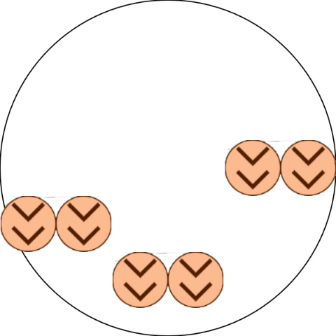
*This is not the only configuration for Exaflare, and waves will not always be adjacent to each other as shown. Exaflares do also overlap about half of themselves as they move down, so keep that in mind.*

There are three main strategies to dodge Exaflares:

### 3 to 1 Dodges/2 to 1 Dodges (Middle Strat)

This is a strat that requires a lot more effort, but is usually very
consistent. We can label Exaflare waves in the format ######, wherein # is what
wave it is. For example:

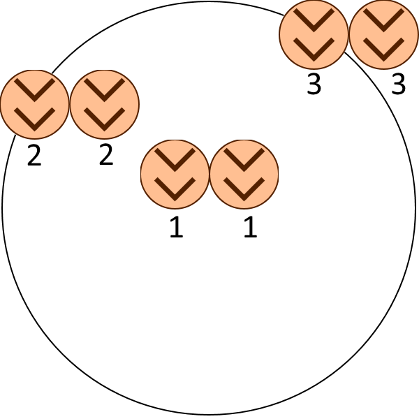
*This would be a 221133 pattern.*

Try to find places where 3 and 1 Exaflares are adjacent to each other. After
doing so, stand in the lane with the 3 Exaflare, wait for the 1 Exaflare to
pass next to you, and then move into that lane. A diagram is shown below:

*Line yourself up with the 3 lane.*

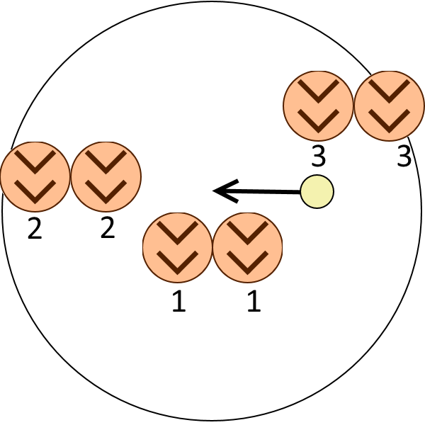
*Wait until the 1 flare passes next to you, and then shift into that lane.*

*You're done!*

<button aria-label="Previous" class="glider-prev">«</button>
<button aria-label="Next" class="glider-next">»</button>

Sometimes, a 3 to 1 dodge will not be available, in which case you'll have to
make do with a 2 to 1 dodge or a 3 to 2 dodge. The general idea of the dodge is
the same, except timing is a lot more strict. Be sure to dodge into the top
half of the marker, to make sure you aren't clipped by an Exaflare.

*Make sure to dodge to the back half of the Exaflare mark as soon as it
disappears, to succesfully make a 3 to 2/2 to 1 dodge.*

### Straight Through (Lucrezia Strat)

This is the riskier strat, but will be very easy if done correctly. Begin by
placing yourself in front of an Exaflare puddle marker. As soon as the puddle
disappears, run through the puddle, onto the upper edge of the marker. If done
correctly, it will look as if you ran into the explosion, but you'll still be
alive. A gif of this being executed is shown below:

&nbsp;

### Wall Strat

Probably the safest and most recommended strat. Begin by positioning yourself
near a wall, and stand next to an exaflare arrow. Wait for the arrow to
disappear, and move inside it. It's very similar to the Lucrezia Strat, except
moving into the exaflare from the side. The pros to this strat are you're
reacting to the arrow disappearing, giving you more time to find and prepare
for Exaflares.

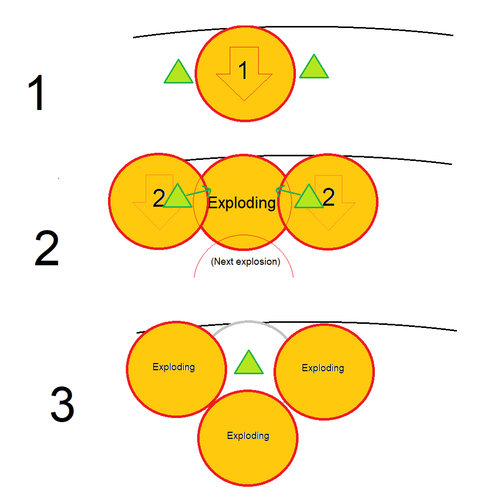
*Exaflares will not always be in this position. Thanks to Taal Kheru for the diagram.*

Bahamut will follow up with another Akh Morn, this time adding an extra hit to
the end. He will then use Exaflare, followed by Morn Afah, followed by Akh
Morn, and repeat these three moves until he enrages.

Bahamut's Enrage will be a series of Morn Afahs dealing lethal damage,
regardless of how many players are stacked. In order to gain a few extra
seconds, have your party spread out so he hits every player individually
one-by-one, depending on Bahamut's enmity. You may want to consider having your
tanks shirk your healer who does the least DPS (usually the scholar) to
maximize raid DPS.

<blockquote>

**Rotation**

Akh Morn starts at 3 hits, and every cast adds an extra hit to Akh Morn.

* Morn Afah
* Akh Morn x3
* Exaflare
* Akh Morn x4
* Morn Afah
* Exaflare
* Morn Afah
* Akh Morn x5
* Exaflare
* Morn Afah
* Akh Morn x6
* Exaflare
* Morn Afah
* Morn Afah (Enrage)

</blockquote>

If you've defeated Bahamut Prime, congratulations! You've defeated probably the
hardest content in the history of FFXIV. You'll be rewarded with a Dreadwyrm
Totem, which can be exchanged in Rhalgr's Reach for an i345 Ultimate Dreadwyrm
weapon of your choice.

This fight is all about consistency. The number of times you'll have to do Nael
and Twintania should make it seem like clockwork. I'd highly recommend focusing
more on executing mechanics, instead of trying to push damage, as these DPS
checks are very lenient.

If you have any questions, thoughts, or concerns, please
[open an issue at the ultimates.guide GitHub repository](https://github.com/Veraticus/ultimates/guide).

Special thanks to everyone involved in proofreading and creating this guide.

<blockquote>

**Changelog**

**v1.0 - 11/15/2017**
* Official Release

**v1.11 – 1/2/2018**
* Fixed description of Liquid Hell.
* Added Exaflare "Wall Strat."
* Fixed typo on adds phase.

**v1.2 - 6/19/2018**
* Added Change Log to the actual page.

**v1.3 - 1/6/2019**
* Editted Fellruin Trio tower diagram/strategy.
* Fixed some grammatical errors.

**v1.4 - 3/6/2019**
* Added footnote involving Tank LB strat for Grand Octet.

**v2.0 - 4/7/2019**
* Major rewriting of multiple areas.
* Added note touching on ilvl sync
* Twintania
  * Changed outlined strategy to the more popular single baiter strategy.
  * Fixed a typo involing the description of Liquid Hell (Distance).
* Bahamut
  * Changed outlined strategy to a more simple "run-along-the-wall" strat for Grand Octet.
* Teraflare
  * Clarified boss positioning.
  * Outlined strategies to avoid Twister + Generate
  * Added a note for the tank swap.
  * Added a note involving weakness during Wings of Rebirth
* Golden Bahamut
  * Changed outlined timings to the end of the cast, instead of the beginning
* Miscallaneous changes to spelling and poor writing.

**v2.11 - 4/9/2019**
* Nael
  * Fixed divebomb marking section.
* Teraflare
  * Added in a note involving exactly what happens during White Fury/Twin Fury.
* Fixed various typos

**v2.12 - 6/2/2019**
* Clarified Megaflare description during Quickmarch Trio.
* Clarified target selection for Grand Octet Megaflare.

**v2.2 - 7/2/2019**
* Updated Nael quotes.

To-do:

* Add in single safespot strat for Tenstrike

**v3.0 - 11/11/2020**
* Copy content to ultimates.guide
* Some editing and style tweaks and cleanups

</blockquote>
